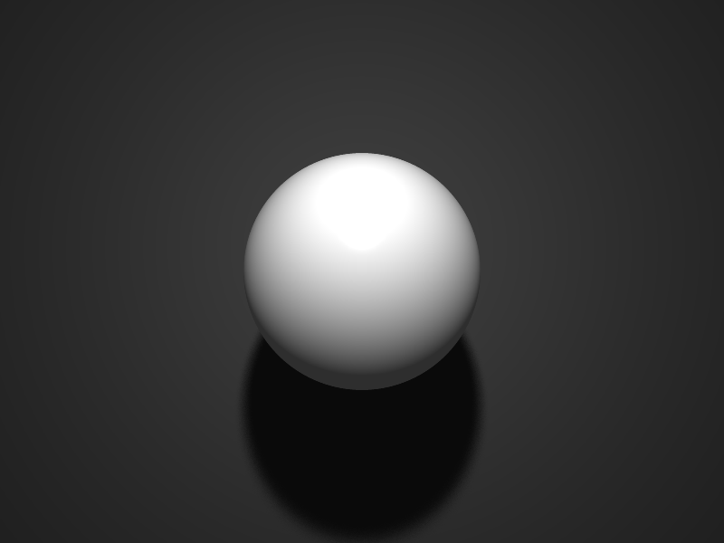

Spheretracer
============
[](https://travis-ci.org/okey/spheretracer)

Spheretracer is a basic ray tracer I wrote to learn Rust.
Spheres are currently the only available primitive type, and illumination uses the Phong model.
It supports supersampled antialiasing, random light sampling (soft shadows), and reflective sufaces.

### Running the tracer
- Build and test spheretracer using Cargo
- Run it with `cargo run path/to/scenefile.txt`

### Scene files
Take a look at some [examples](examples), or read on.

```
# Example scene file - this is a comment
# The basic format per-line: keyword x y z

# Chroma and intensity colour values are combined as simple RGB
# Each channel value should be in [0.0, 1.0]

imagesize 800 600 # image size specifies the size of the image to be rendered
background 0.2 0.4 0.6 # this is the background colour
ambient 0.2 0.2 0.2 # this is the ambient lighting

# A specify a light with light x y z r g b 
light  0.0 0.5 1.0   1.0 1.0 1.0

# A sphere of radius 0.4 positioned at the origin
sphere 0.4
# It has an outer material property specified with the following syntax
# outer diffuse-colour-rgb mirror-colour-rgb highlight-colour-rgb specular-coefficient
outer 0.9 0.9 0.9   0.0 0.0 0.0   0.5 0.5 0.5  50

# You can also specify an inner material in the same way
# inner 0.1 0.1 0.1 0.0 0.0 0.0 0.5 0.5 0.5 10

# Move the sphere with translate x y z
# translate 1 2 3.5

# Rotate the sphere with rotate x/y/z degrees or rotate x y z degrees
# rotate x 90
# rotate 1 0 0 90

# Scale the sphere with scale x y z
# scale 3 2 1.5

# Add a really big grey sphere and move it back a bit
sphere 100
outer 0.2 0.2 0.2   0.0 0.0 0.0   1.0 1.0 1.0  50
translate 0 0 -104
```

Running the raytracer on this will produce: 

### TODO

- [ ] Transparent objects
- [ ] Rewrite sceneio.rs
   - [ ] Allow AA and soft shadows to be specified in the scene file
- [ ] Rewrite vector and colour macros
- [ ] Implement space division to avoid pathlogical cases, esp. with AA and soft shadows
- [ ] Support writing to image files
- [ ] Better OpenGL rendering
